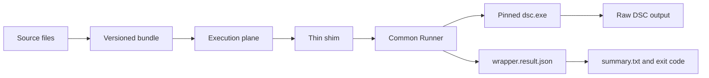

<!-- markdownlint-disable MD013 -->
# Architecture

## Metadata

- **Status:** Draft
- **Owner:** Repository Maintainers
- **Last Updated:** 2026-05-03
- **Scope:** High-level ProStateKit component model and data flow.
- **Related:** [Contract](contract.md), [Packaging](packaging.md), [Evidence Schema](evidence-schema.md)

## Components

ProStateKit has four primary parts: DSC configuration documents, a common Runner, thin execution-plane shims, and durable evidence. The execution plane decides when and where work runs. The Runner validates inputs, invokes DSC, preserves raw output, normalizes evidence, and translates the result.

## Data Flow

## Current Status

The architecture now has the preview command surface, runtime-mode selection, manifest hash checks when a bundle manifest exists, DSC invocation, parser normalization, sanitized transcript summaries, reboot marker handoff cleanup, and evidence writing in place. Lab-validated resource behavior and reboot orchestration remain TODOs.
