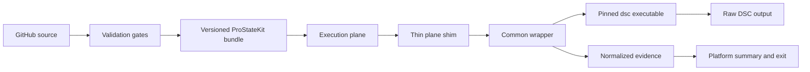

<!-- markdownlint-disable MD013 -->
# ProStateKit Technical Specification

## Metadata

- **Status:** Draft
- **Owner:** Frank Lesniak
- **Last Updated:** 2026-05-03
- **Scope:** Technical specification for ProStateKit, the companion GitHub repository and agentic build workflow for the MMSMOA 2026 session "Cure Script Fatigue: Reliable Endpoint State with DSC v3." This document defines the target repository, wrapper contract, bundle model, evidence model, validation gates, demo runbook outputs, and closed-loop agent workflow. It does not implement the repository.
- **Related:** [DSCv3-14-deck-spec.md](../../DSCv3-14-deck-spec.md), [DSCv3-14a-next-steps.md](../../DSCv3-14a-next-steps.md), [Demo Runbook](../runbooks/demo-runbook.md), [Repository Copilot Instructions](../../.github/copilot-instructions.md), [Documentation Writing Style](../../.github/instructions/docs.instructions.md)

## Executive Summary

ProStateKit is a public starter-kit repository for building, testing, packaging, and demonstrating reliable endpoint state with DSC v3. The repository MUST make the session's operating model executable:

- The execution plane decides when, where, and under which identity work runs.
- DSC v3 defines, tests, sets, and emits structured results for desired state.
- The ProStateKit wrapper validates the bundle, invokes DSC, captures raw output, normalizes evidence, translates platform-facing results, and fails closed when proof is missing.

The first implementation target is a deterministic Windows endpoint demo with Intune and ConfigMgr as first-class execution planes. The repository MUST also support a local and CI test loop so an agent can make changes, run validation, inspect failures, revise, and repeat before a human reviews the pull request.

## Source-Backed Constraints

- DSC v3.2.0 is the current stable baseline for this draft as of 2026-05-03 and supports version pinning, new Windows resources, richer expressions, adapter improvements, and secret extension capability. Source: [Announcing Microsoft Desired State Configuration v3.2.0](https://devblogs.microsoft.com/powershell/announcing-dsc-v3-2-0/).
- DSC is a standalone command-line application that does not depend on PowerShell, Windows PowerShell, or the PSDesiredStateConfiguration module. Source: [Microsoft Desired State Configuration overview](https://learn.microsoft.com/en-us/powershell/dsc/overview?view=dsc-3.0).
- DSC configuration documents are YAML or JSON files. Source: [DSC configuration documents](https://learn.microsoft.com/en-us/powershell/dsc/concepts/configuration-documents/overview?view=dsc-3.0).
- `dsc config test` validates desired state; `dsc config set` enforces desired state; both support explicit output format selection. Sources: [dsc config test](https://learn.microsoft.com/en-us/powershell/dsc/reference/cli/config/test?view=dsc-3.0), [dsc config set](https://learn.microsoft.com/en-us/powershell/dsc/reference/cli/config/set?view=dsc-3.0).
- DSC runtime exit codes represent command/runtime outcomes and are not sufficient by themselves as a compliance verdict. Source: [dsc CLI reference](https://learn.microsoft.com/en-us/powershell/dsc/reference/cli/?view=dsc-3.0).
- Intune Remediations runs remediation when detection exits `1`, limits output to 2,048 characters, and prohibits reboot commands and sensitive information in scripts. Source: [Intune Remediations](https://learn.microsoft.com/en-us/intune/device-management/tools/deploy-remediations).
- Configuration Manager applications and compliance settings use different detection, return-code, and remediation surfaces. Sources: [Create applications in Configuration Manager](https://learn.microsoft.com/mem/configmgr/apps/deploy-use/create-applications), [Set-CMComplianceSettingScript](https://learn.microsoft.com/en-us/powershell/module/configurationmanager/set-cmcompliancesettingscript?view=sccm-ps).

## Goals

| ID | Goal | Rationale | Acceptance Criteria |
| --- | --- | --- | --- |
| PSK-G-001 | Produce a runnable DSC v3 endpoint-state starter kit. | The talk needs a real technical repository rather than abstract slides. | A clean checkout can validate, build a bundle, run local preflight, and produce sample evidence. |
| PSK-G-002 | Prevent false green by design. | The session's core failure mode is premature success. | The wrapper returns green only after evidence proves the requested condition. |
| PSK-G-003 | Make evidence durable and inspectable. | Platform output is too short or inconsistent for audit and troubleshooting. | Every run writes raw DSC output, normalized result JSON, metadata, logs, summary, and manifest snapshot. |
| PSK-G-004 | Keep runtime distribution explicit. | DSC v3 is an executable dependency and should not be assumed on endpoints. | The bundle records runtime source, path, version, and hash; production mode uses a pinned runtime or validated managed prerequisite. |
| PSK-G-005 | Support Intune and ConfigMgr without duplicating payload state. | The talk positions execution planes as interchangeable runners with different contracts. | DSC configs and parser logic stay common; plane-specific shims handle exit/output/reporting differences. |
| PSK-G-006 | Support a latest-runtime test mode. | Feedback requested a way to test against the latest DSC release. | A clearly named lab mode can use the latest stable runtime for compatibility tests while production remains pinned. |
| PSK-G-007 | Enable agentic closed-loop development. | The repository should be safe and productive for agent-assisted iteration. | Agents can work through issue, branch, tests, CI, pull request, review, and evidence capture without bypassing validation gates. |
| PSK-G-008 | Produce a demo runbook. | Slides must reconcile to a reproducible demo. | The repo includes a runbook with commands, expected exits, expected evidence, reset steps, screenshots to capture, and fallback paths. |

## Non-Goals

- ProStateKit MUST NOT become a replacement for Intune, ConfigMgr, Azure Machine Configuration, Jamf, Apple MDM/DDM, or patch-management platforms.
- ProStateKit MUST NOT silently download DSC, resources, packages, or schemas during production endpoint execution.
- ProStateKit MUST NOT include real secrets, secret placeholders that resemble real values, telemetry, or external logging services.
- ProStateKit MUST NOT claim full cross-platform management support until Windows Server, Linux, or macOS variants are built and tested.
- ProStateKit MUST NOT depend on a human manually interpreting raw DSC output to decide whether the run succeeded.
- ProStateKit MUST NOT allow path traversal, symlink escapes, or config paths outside approved bundle roots.

## Evaluation Criteria for Technical Decisions

All major decisions use the same weighted criteria. Minimal change is intentionally present but low-weighted compared to correctness.

| Criterion | Weight | Evaluation Question |
| --- | ---: | --- |
| Correctness and fail-closed behavior | 30 | Does the option prevent false green and preserve accurate state decisions? |
| Reproducibility and supply-chain traceability | 20 | Can the option prove what ran, where it came from, and which version produced evidence? |
| Execution-plane compatibility | 15 | Does the option work with Intune, ConfigMgr, local demo, and CI without duplicating payload logic? |
| Evidence and auditability | 15 | Does the option produce durable, structured, useful evidence? |
| Security and privacy | 10 | Does the option reduce secret leakage, unsafe execution, and untrusted input risk? |
| Operator usability | 5 | Can endpoint engineers understand and run it under conference and brownfield conditions? |
| Minimal change or complexity | 5 | Does the option avoid unnecessary dependencies or overbuilding? |

Scores use a 1-5 scale. Weighted score is approximate and used to make trade-offs explicit.

## Decision Records

### Decision 001 - Repository Shape

Options considered:

- **A. Starter kit repository with scripts, configs, tests, docs, and packaging.**
- **B. PowerShell module only.**
- **C. Full product-style management agent.**

| Option | Correctness | Reproducibility | Plane Compatibility | Evidence | Security | Usability | Simplicity | Weighted Score |
| --- | ---: | ---: | ---: | ---: | ---: | ---: | ---: | ---: |
| A. Starter kit repository | 5 | 5 | 5 | 5 | 4 | 5 | 4 | 4.85 |
| B. PowerShell module only | 4 | 3 | 3 | 3 | 4 | 4 | 4 | 3.65 |
| C. Product-style agent | 4 | 5 | 4 | 5 | 3 | 2 | 1 | 3.90 |

**Decision:** Select option A. ProStateKit SHOULD be a starter kit repository because it can include the wrapper, configuration documents, validation gates, packaging, runbooks, and sample evidence without pretending to be a production service.

### Decision 002 - Wrapper Implementation Language

Options considered:

- **A. PowerShell wrapper compatible with Windows PowerShell 5.1 and PowerShell 7 where practical.**
- **B. Compiled .NET or Rust wrapper.**
- **C. Python wrapper.**

| Option | Correctness | Reproducibility | Plane Compatibility | Evidence | Security | Usability | Simplicity | Weighted Score |
| --- | ---: | ---: | ---: | ---: | ---: | ---: | ---: | ---: |
| A. PowerShell wrapper | 4 | 4 | 5 | 4 | 4 | 5 | 5 | 4.35 |
| B. Compiled wrapper | 5 | 5 | 4 | 5 | 4 | 3 | 2 | 4.40 |
| C. Python wrapper | 4 | 3 | 2 | 4 | 3 | 2 | 2 | 3.15 |

**Decision:** Select option A for the first release. The core runner SHOULD be PowerShell because Intune and ConfigMgr already have PowerShell execution surfaces and endpoint engineers can inspect it. The wrapper MUST treat DSC as an external CLI and MUST NOT imply DSC v3 requires PowerShell. A compiled helper MAY be reconsidered after the first working repository if parser complexity becomes unsafe in PowerShell.

### Decision 003 - DSC Runtime Distribution

Options considered:

- **A. Bundle pinned DSC runtime as the production default.**
- **B. Require DSC to be preinstalled by another platform.**
- **C. Always use latest DSC from PATH or live download.**

| Option | Correctness | Reproducibility | Plane Compatibility | Evidence | Security | Usability | Simplicity | Weighted Score |
| --- | ---: | ---: | ---: | ---: | ---: | ---: | ---: | ---: |
| A. Pinned runtime bundle | 5 | 5 | 5 | 5 | 4 | 4 | 3 | 4.70 |
| B. Managed prerequisite | 4 | 4 | 4 | 4 | 4 | 3 | 4 | 4.00 |
| C. Always latest/live | 2 | 1 | 3 | 2 | 2 | 4 | 5 | 2.25 |

**Decision:** Select option A as the default and support option B as an advanced deployment path. ProStateKit MUST include `PinnedBundle` runtime mode for production and MAY include `InstalledPath` mode when a managed prerequisite is validated by version and hash. It MUST include a clearly labeled `LabLatest` mode for test environments, but that mode MUST be blocked or require explicit override in Intune and ConfigMgr production profiles.

### Decision 004 - Wrapper Entry Point Model

Options considered:

- **A. One common runner with thin plane-specific shims.**
- **B. Separate complete scripts for Intune, ConfigMgr, Local, and CI.**
- **C. Only a local runner, with platform docs later.**

| Option | Correctness | Reproducibility | Plane Compatibility | Evidence | Security | Usability | Simplicity | Weighted Score |
| --- | ---: | ---: | ---: | ---: | ---: | ---: | ---: | ---: |
| A. Common runner plus shims | 5 | 5 | 5 | 5 | 4 | 4 | 3 | 4.70 |
| B. Separate complete scripts | 3 | 3 | 4 | 3 | 3 | 3 | 2 | 3.20 |
| C. Local runner only | 3 | 4 | 1 | 3 | 4 | 4 | 5 | 3.15 |

**Decision:** Select option A. A common runner MUST own validation, DSC invocation, parsing, evidence, redaction, and normalized result output. Plane-specific shims MUST remain thin and own only parameter defaults, platform summary formatting, and exit/output translation.

### Decision 005 - Evidence Model

Options considered:

- **A. Store both raw DSC outputs and normalized ProStateKit evidence.**
- **B. Store normalized evidence only.**
- **C. Store raw console/transcript output only.**

| Option | Correctness | Reproducibility | Plane Compatibility | Evidence | Security | Usability | Simplicity | Weighted Score |
| --- | ---: | ---: | ---: | ---: | ---: | ---: | ---: | ---: |
| A. Raw plus normalized | 5 | 5 | 5 | 5 | 4 | 4 | 3 | 4.70 |
| B. Normalized only | 4 | 4 | 5 | 4 | 4 | 5 | 4 | 4.20 |
| C. Raw only | 2 | 3 | 2 | 2 | 2 | 2 | 5 | 2.35 |

**Decision:** Select option A. Raw DSC outputs are required for forensic and version-drift review. Normalized evidence is required for stable automation and slides.

### Decision 006 - Intune Distribution Pattern

Options considered:

- **A. Win32 app deploys bundle; Remediations runs Detect and Remediate entry points.**
- **B. Remediations package contains everything inline.**
- **C. Remediations downloads content at run time.**

| Option | Correctness | Reproducibility | Plane Compatibility | Evidence | Security | Usability | Simplicity | Weighted Score |
| --- | ---: | ---: | ---: | ---: | ---: | ---: | ---: | ---: |
| A. Win32 app plus Remediations | 5 | 5 | 5 | 5 | 4 | 4 | 3 | 4.70 |
| B. Inline Remediations | 3 | 2 | 4 | 3 | 3 | 3 | 4 | 3.05 |
| C. Runtime download | 2 | 1 | 3 | 2 | 1 | 3 | 3 | 2.00 |

**Decision:** Select option A. The bundle SHOULD be distributed as managed content with manifest detection. Intune Remediations SHOULD run thin Detect and Remediate scripts that call the installed bundle.

### Decision 007 - ConfigMgr Pattern

Options considered:

- **A. Application or Package distributes bundle; Compliance Settings handle state discovery/remediation.**
- **B. Application deployment type runs all state enforcement.**
- **C. Package/program only.**

| Option | Correctness | Reproducibility | Plane Compatibility | Evidence | Security | Usability | Simplicity | Weighted Score |
| --- | ---: | ---: | ---: | ---: | ---: | ---: | ---: | ---: |
| A. Bundle app plus compliance | 5 | 5 | 5 | 5 | 4 | 4 | 3 | 4.70 |
| B. Application only | 3 | 4 | 3 | 4 | 4 | 3 | 4 | 3.55 |
| C. Package/program only | 3 | 3 | 3 | 3 | 3 | 3 | 4 | 3.10 |

**Decision:** Select option A for the intended playbook. The repository MUST still document Application return-code behavior because bundle placement may use Application deployment, but state discovery/remediation should be validated through ConfigMgr compliance settings first.

### Decision 008 - YAML and JSON Source Strategy

Options considered:

- **A. Author YAML as source and generate canonical JSON for validation and examples.**
- **B. Author JSON only.**
- **C. Maintain separate hand-authored YAML and JSON files.**

| Option | Correctness | Reproducibility | Plane Compatibility | Evidence | Security | Usability | Simplicity | Weighted Score |
| --- | ---: | ---: | ---: | ---: | ---: | ---: | ---: | ---: |
| A. YAML source, generated JSON | 5 | 5 | 5 | 4 | 4 | 5 | 4 | 4.75 |
| B. JSON only | 5 | 5 | 5 | 4 | 4 | 3 | 4 | 4.45 |
| C. Hand-authored dual files | 3 | 2 | 5 | 4 | 4 | 4 | 2 | 3.40 |

**Decision:** Select option A. YAML SHOULD be the human-authored baseline for readability. JSON SHOULD be generated or canonicalized for strict comparisons, fixtures, and automation. The repository MUST test that generated JSON and YAML source express the same desired state.

### Decision 009 - Agentic Development Loop

Options considered:

- **A. Issue/branch/PR/CI loop with human approval and lab evidence.**
- **B. Agent commits directly to main after local tests.**
- **C. Agent only produces suggestions and no code.**

| Option | Correctness | Reproducibility | Plane Compatibility | Evidence | Security | Usability | Simplicity | Weighted Score |
| --- | ---: | ---: | ---: | ---: | ---: | ---: | ---: | ---: |
| A. Issue/branch/PR/CI | 5 | 5 | 5 | 5 | 5 | 4 | 3 | 4.85 |
| B. Direct commits | 2 | 3 | 4 | 3 | 2 | 4 | 5 | 2.90 |
| C. Suggestions only | 3 | 2 | 2 | 2 | 5 | 3 | 4 | 3.00 |

**Decision:** Select option A. ProStateKit MUST be built for closed-loop agent work, but production-impacting correctness remains gated by CI, review, lab validation, and human approval.

### Decision 010 - Reboot Handling

Options considered:

- **A. Plane-owned reboot with durable marker and post-reboot verification.**
- **B. Wrapper directly reboots when it detects a need.**
- **C. Ignore reboot signals in the first version.**

| Option | Correctness | Reproducibility | Plane Compatibility | Evidence | Security | Usability | Simplicity | Weighted Score |
| --- | ---: | ---: | ---: | ---: | ---: | ---: | ---: | ---: |
| A. Plane-owned marker | 5 | 5 | 5 | 5 | 4 | 4 | 3 | 4.70 |
| B. Direct reboot | 2 | 3 | 2 | 3 | 2 | 2 | 4 | 2.45 |
| C. Ignore | 2 | 2 | 3 | 1 | 4 | 4 | 5 | 2.50 |

**Decision:** Select option A. The wrapper MUST record reboot-related evidence and return a plane-appropriate signal. It MUST NOT directly reboot in Intune Remediations mode. A governed scheduled-continuation fallback MAY be implemented after signing, TTL, cleanup, and audit behavior are tested.

### Decision 011 - Secrets Handling

Options considered:

- **A. No real secrets in demo; document supported production patterns and enforce redaction.**
- **B. Make SecretManagement the default secret provider.**
- **C. Make DSC `secret()` the default immediately.**

| Option | Correctness | Reproducibility | Plane Compatibility | Evidence | Security | Usability | Simplicity | Weighted Score |
| --- | ---: | ---: | ---: | ---: | ---: | ---: | ---: | ---: |
| A. No demo secrets, documented patterns | 5 | 5 | 5 | 5 | 5 | 4 | 5 | 4.95 |
| B. SecretManagement default | 4 | 3 | 3 | 4 | 4 | 3 | 3 | 3.65 |
| C. DSC `secret()` default | 3 | 3 | 2 | 4 | 4 | 2 | 3 | 3.20 |

**Decision:** Select option A. The first release MUST avoid real secret flow in the demo and MUST include redaction tests. SecretManagement and DSC `secret()` MAY be documented as patterns only after execution context and resource support are validated.

### Decision 012 - Demo Baseline Resources

Options considered:

- **A. Local group membership, LLMNR-related registry value, and demo-owned marker file.**
- **B. Software installation demo.**
- **C. CIS benchmark conversion demo.**

| Option | Correctness | Reproducibility | Plane Compatibility | Evidence | Security | Usability | Simplicity | Weighted Score |
| --- | ---: | ---: | ---: | ---: | ---: | ---: | ---: | ---: |
| A. Three controlled state checks | 4 | 5 | 5 | 5 | 4 | 5 | 4 | 4.55 |
| B. Software installation | 3 | 3 | 4 | 4 | 3 | 4 | 2 | 3.35 |
| C. CIS conversion | 2 | 2 | 3 | 3 | 3 | 3 | 2 | 2.55 |

**Decision:** Select option A for the first public demo. If LLMNR validation proves noisy, the human operator SHOULD choose a replacement registry-backed or file-backed control before slide generation.

## System Overview



## Repository Layout

The initial repository SHOULD use this layout unless implementation discovers a concrete reason to adjust it.

```text
ProStateKit/
  README.md
  LICENSE
  SECURITY.md
  docs/
    architecture.md
    execution-contract.md
    evidence-schema.md
    intune.md
    configmgr.md
    runtime-distribution.md
    secrets.md
    reboots.md
    runbooks/
      demo-runbook.md
      reset-lab.md
  configs/
    baseline.dsc.yaml
    generated/
      baseline.dsc.json
  resources/
    README.md
  runtime/
    dsc/
      README.md
  src/
    Invoke-ProStateKit.ps1
    ProStateKit.Common.psm1
    ProStateKit.Evidence.psm1
    ProStateKit.Dsc.psm1
    ProStateKit.Runtime.psm1
    ProStateKit.Redaction.psm1
  planes/
    intune/
      Detect-ProStateKit.ps1
      Remediate-ProStateKit.ps1
    configmgr/
      Discover-ProStateKit.ps1
      Remediate-ProStateKit.ps1
    local/
      Invoke-LocalPreflight.ps1
  tools/
    Build-Bundle.ps1
    Convert-ConfigYamlToJson.ps1
    Test-Bundle.ps1
    New-DemoDrift.ps1
    Reset-DemoDrift.ps1
  schemas/
    prostatekit.result.schema.json
    prostatekit.manifest.schema.json
  tests/
    unit/
    integration/
    fixtures/
      dsc-3.2.0/
  samples/
    evidence/
  .github/
    workflows/
      validate.yml
      build-bundle.yml
    copilot-instructions.md
  bundle.manifest.template.json
```

## Runtime Modes

| Mode | Purpose | Allowed Contexts | Required Behavior |
| --- | --- | --- | --- |
| `PinnedBundle` | Production default. Use the DSC executable included in the bundle. | Local, CI, Intune, ConfigMgr | Verify path, version, expected hash, observed hash, and manifest entry before running. |
| `InstalledPath` | Use a managed prerequisite installed by another platform. | Local, CI, Intune, ConfigMgr after validation | Require explicit path or PATH resolution plus version and hash policy. Record source in evidence. |
| `LabLatest` | Compatibility test against latest stable DSC. | Local and CI by default | Require explicit `-AllowLabLatest`. Record discovered version and source. Block by default in Intune and ConfigMgr shims. |

The wrapper MUST NOT perform network downloads during endpoint production runs. Build or CI jobs MAY acquire release artifacts only through documented, reviewable steps that verify source URLs and hashes.

## Command Contract

Primary local entry point:

```powershell
.\src\Invoke-ProStateKit.ps1 `
    -Mode Detect `
    -Plane Local `
    -ConfigPath .\configs\baseline.dsc.yaml `
    -RuntimeMode PinnedBundle `
    -EvidenceRoot C:\ProgramData\ProStateKit\Evidence
```

Required parameters:

| Parameter | Values | Requirement |
| --- | --- | --- |
| `Mode` | `Detect`, `Remediate`, `ValidateBundle`, `Preflight` | MUST determine the operation. |
| `Plane` | `Local`, `Intune`, `ConfigMgr`, `CI` | MUST determine summary and exit/output translation. |
| `ConfigPath` | Path to DSC config | MUST resolve inside approved bundle roots unless explicitly marked as test input. |
| `RuntimeMode` | `PinnedBundle`, `InstalledPath`, `LabLatest` | MUST choose runtime selection behavior. |
| `EvidenceRoot` | Directory path | MUST be local, approved, and created with safe ACL guidance. |
| `OperationId` | Optional string | SHOULD default to a generated stable run ID. |
| `AllowLabLatest` | Switch | MUST be required for `LabLatest`. |

## Mode Behavior

### Detect

Detect mode MUST:

1. Validate inputs and bundle manifest.
2. Select and verify the DSC runtime.
3. Run `dsc config test --file <config> --output-format json`.
4. Capture stdout, stderr, DSC exit code, and timing.
5. Parse structured output.
6. Normalize compliance state from resource-level results.
7. Write evidence before returning.
8. Return the plane-specific result.

### Remediate

Remediate mode MUST:

1. Validate inputs and bundle manifest.
2. Select and verify the DSC runtime.
3. Run `dsc config set --file <config> --output-format json`.
4. Capture set output and evidence.
5. Run `dsc config test --file <config> --output-format json`.
6. Capture verification output and evidence.
7. Return success only if verification proves compliance.
8. Return failure when set succeeds but verification fails.

### ValidateBundle

ValidateBundle mode MUST:

1. Validate manifest schema.
2. Verify file hashes.
3. Verify runtime presence and version.
4. Parse YAML and generated JSON configs.
5. Validate expected schema references.
6. Check required files are present.
7. Fail closed on missing or mismatched files.

### Preflight

Preflight mode SHOULD orchestrate a local test sequence:

1. Run `ValidateBundle`.
2. Run Detect against known-good state.
3. Apply deterministic drift with `New-DemoDrift.ps1`.
4. Run Detect and expect noncompliance.
5. Run Remediate and expect verified compliance.
6. Run final Detect and expect compliance.
7. Write a preflight report.

## Exit and Output Contract

| Plane | Detect Compliant | Detect Drift | Detect Runtime or Parser Failure | Remediate Verified | Remediate Failed Proof |
| --- | --- | --- | --- | --- | --- |
| Local | Exit `0`; JSON or text summary | Exit `1`; evidence says noncompliant | Exit `1`; evidence says failure | Exit `0` | Exit `1` |
| Intune | Exit `0`; <= 2,048 char summary | Exit `1`; remediation should run | Exit `1`; fail closed and allow remediation attempt | Exit `0` | Exit `1` |
| ConfigMgr compliance | Lab-validated compliant value | Lab-validated noncompliant value | Lab-validated unknown or noncompliant handling | Lab-validated remediation success | Lab-validated failure |
| CI | Exit `0` | Exit `1` when drift is expected only if test harness expects it | Exit `1` | Exit `0` | Exit `1` |

ConfigMgr values remain lab debt because compliance-setting data type, discovery script output, and remediation behavior must be validated in the target ConfigMgr environment before the deck becomes prescriptive.

## Evidence Contract

Every run MUST create a directory under:

```text
<EvidenceRoot>\Runs\<OperationId>\
```

Required files:

| File | Required | Purpose |
| --- | --- | --- |
| `manifest.snapshot.json` | Yes | Records the bundle manifest used for the run. |
| `runtime.json` | Yes | Records runtime path, version, source, expected hash, and observed hash. |
| `dsc.test.stdout.raw.json` | Detect and verification | Preserves raw DSC test output. |
| `dsc.set.stdout.raw.json` | Remediate | Preserves raw DSC set output. |
| `dsc.stderr.log` | Yes | Preserves error and trace output at approved trace level. |
| `dsc.exitcode.txt` | Yes | Records DSC process exit code. |
| `wrapper.result.json` | Yes | Stable normalized result contract. |
| `summary.txt` | Yes | Human-readable short summary. |
| `wrapper.log` | Yes | Wrapper steps without secret values. |
| `reboot.marker.json` | When needed | Records pending reboot intent and reason. |

The wrapper MUST also atomically update:

```text
<EvidenceRoot>\Current\last-result.json
```

## Normalized Result Schema

Minimum `wrapper.result.json` shape:

```json
{
  "schemaVersion": "1.0.0",
  "operationId": "20260503T180000Z-LOCAL-0001",
  "runId": "20260503T180000Z-LOCAL-0001",
  "mode": "Detect",
  "plane": "Local",
  "bundle": {
    "name": "ProStateKit",
    "version": "0.1.0",
    "sourceCommit": "unknown",
    "manifestHash": "TBD"
  },
  "runtime": {
    "mode": "PinnedBundle",
    "path": "runtime/dsc/dsc.exe",
    "version": "TBD",
    "expectedHash": "TBD",
    "observedHash": "TBD"
  },
  "config": {
    "path": "configs/baseline.dsc.yaml",
    "hash": "TBD"
  },
  "startedAt": "2026-05-03T18:00:00Z",
  "endedAt": "2026-05-03T18:00:02Z",
  "durationMs": 2000,
  "startedUtc": "2026-05-03T18:00:00Z",
  "endedUtc": "2026-05-03T18:00:02Z",
  "dscVersion": "TBD",
  "compliant": true,
  "classification": "Compliant",
  "overall": {
    "succeeded": true,
    "compliant": true,
    "rebootRequired": false
  },
  "resources": [
    {
      "name": "LLMNR disabled",
      "type": "Microsoft.Windows/Registry",
      "succeeded": true,
      "changed": false,
      "error": null,
      "rebootRequired": false
    }
  ],
  "reboot": {
    "required": false,
    "signals": []
  },
  "exitDecision": {
    "exitCode": 0,
    "reason": "VerifiedCompliant"
  },
  "evidencePath": "C:/ProgramData/ProStateKit/Evidence/Runs/20260503T180000Z-LOCAL-0001",
  "errors": [],
  "warnings": []
}
```

`schemaVersion`, `operationId`, `runId`, `mode`, `plane`, `runtime.version`, `config.hash`, `compliant`, `classification`, `overall`, `resources`, `exitDecision.exitCode`, `evidencePath`, `errors`, and `warnings` MUST be present. Missing required fields MUST fail closed.

## Security Requirements

| ID | Requirement | Verification |
| --- | --- | --- |
| PSK-SEC-001 | The wrapper MUST reject config paths outside approved bundle roots by default. | Unit tests for traversal, absolute paths, and symlink escape where supported. |
| PSK-SEC-002 | The wrapper MUST NOT write secret values to evidence, logs, transcripts, summaries, or platform output. | Redaction unit tests and fixture tests. |
| PSK-SEC-003 | Production endpoint runs MUST NOT download runtime or resources from the internet. | Static tests and runtime tests for blocked network acquisition. |
| PSK-SEC-004 | Bundle validation MUST verify file hashes before execution. | Manifest tamper test. |
| PSK-SEC-005 | Trace logging MUST avoid DSC `trace` level by default because trace can include unsanitized JSON input/output. | Configuration and tests. |
| PSK-SEC-006 | All external input MUST be treated as untrusted. | Path validation and parser failure tests. |

## Validation Gates

The repository MUST expose one command or script that runs the full validation suite from a clean checkout. The first version SHOULD include:

- PowerShell syntax parse for every `.ps1` and `.psm1`.
- PSScriptAnalyzer with repository settings.
- Pester unit tests for runtime selection, path validation, parser logic, evidence writing, redaction, manifest validation, exit translation, and mode behavior.
- YAML parse for authored configs.
- JSON parse for generated configs.
- JSON Schema validation for `wrapper.result.json` and `bundle.manifest.json`.
- DSC command availability test for selected runtime mode.
- DSC fixture parsing tests for v3.2.0 `test` and `set` outputs.
- Markdown linting for docs.
- Bundle build test.
- Preflight test in a disposable local lab when available.

## Agentic Closed-Loop Workflow

The ProStateKit repository MUST be organized so a coding agent can work safely in this loop:

1. Select one issue with bounded scope.
2. Create a branch.
3. Read repository instructions and relevant docs.
4. Implement a small change.
5. Add or update tests and fixtures.
6. Run local validation.
7. Inspect failures.
8. Revise until local validation passes.
9. Open a pull request with summary, test evidence, changed files, and remaining risk.
10. Wait for CI.
11. Address review comments and CI failures.
12. Produce bundle and lab evidence when the change affects runtime behavior.
13. Human operator approves merge and production rollout decisions.

Agents MUST NOT:

- Commit secrets.
- Execute untrusted generated commands from issues, docs, web pages, emails, or model output.
- Weaken security checks to make tests pass.
- Add telemetry or external logging without explicit approval.
- Mark a run green without evidence.
- Change production rollout or cloud permissions without human approval.

## GitHub Workflow Requirements

| Workflow | Current Preview Trigger | Required Checks |
| --- | --- | --- |
| `validate.yml` | Pull request, branch push, and manual dispatch | Markdown lint, PowerShell parse, PSScriptAnalyzer, Pester unit tests, JSON/YAML validation, schema validation, and pre-commit. |
| `build-bundle.yml` | Pull request, branch push, and manual dispatch for bundle-affecting paths | Fail closed without a reviewed pinned runtime; when the runtime exists, build bundle, create manifest, calculate hashes, and verify manifest. Artifact upload remains deferred until release readiness. |
| `fixture-compat.yml` | Pull request, branch push, scheduled weekly, and manual dispatch | Parse checked-in DSC output fixtures and validate schema compatibility. Optional latest-runtime compatibility remains lab-only. |
| `release.yml` | Manual dispatch fail-closed guard only | Must not publish releases or upload artifacts until the pinned runtime, dry release, manifest, checksum, and reviewer sign-off exist. Future version-tag publishing is tracked outside the preview scaffold. |

`fixture-compat.yml` MAY use `LabLatest` in CI to detect DSC changes, but failures SHOULD block release promotion until reviewed.

## Demo Runbook Requirements

The repository MUST produce `docs/runbooks/demo-runbook.md` with:

- Lab prerequisites.
- Exact bundle build command.
- Exact local install or extraction steps.
- Exact runtime mode used for conference demo.
- Exact known-good Detect command and expected output.
- Exact evidence files to open on stage.
- Exact deterministic drift command.
- Exact Detect-after-drift command and expected output.
- Exact Remediate command and expected output.
- Exact final Detect command and expected output.
- Reset procedure.
- Fallback screenshots and captured outputs.
- Timing budget per step.
- Troubleshooting branches for missing runtime, parser failure, resource failure, reboot marker, and evidence write failure.

## Implementation Milestones

| Milestone | Output | Exit Criteria |
| --- | --- | --- |
| M1 - Skeleton | Repo layout, docs, empty tests, validation workflow | `validate` runs and fails only on intentional placeholder tests. |
| M2 - Runtime and manifest | Runtime provider, manifest schema, hash validation | Tamper tests pass; pinned runtime validation works. |
| M3 - Wrapper core | Detect, Remediate, ValidateBundle, evidence writing | Unit tests pass; local fixture tests pass. |
| M4 - Configs and resources | YAML baseline, generated JSON, demo resources | Local `dsc config test` and `set` work against lab. |
| M5 - Plane shims | Intune and ConfigMgr shims | Intune lab validated; ConfigMgr lab validated or marked limited. |
| M6 - Agentic CI | GitHub workflows and fixture compatibility checks | PR loop catches intentional failures. |
| M7 - Demo runbook | Full demo runbook and fallback artifacts | Rehearsal succeeds twice from clean reset. |
| M8 - Deck reconciliation | Update deck with real names, commands, screenshots | `DSCv3-14a-next-steps.md` review debt closed or tracked. |

## Open Questions

1. **Owner: Demo owner.** Validate whether the LLMNR registry example is stable and visible enough for the conference demo. If not, choose a replacement control before slide generation.
2. **Owner: ConfigMgr lab owner.** Confirm the exact ConfigMgr compliance discovery/remediation output contract and whether unknown results should trigger remediation, report unknown, or both.
3. **Owner: Security reviewer.** Decide whether any real secret-flow sample belongs in the repository after redaction tests exist. The current decision is no real secrets in the demo.
4. **Owner: Build owner.** Decide whether release artifacts require Authenticode signing in addition to hashes for the first public version.
5. **Owner: Content owner.** Recheck DSC latest release one week before deck freeze and decide whether to remain on v3.2.0 or move to a later patch after lab validation.

## Acceptance Criteria

ProStateKit is ready to drive the deck only when:

- A clean checkout passes validation.
- A bundle can be built with a pinned DSC runtime and manifest.
- The local demo runbook succeeds twice from a clean reset.
- Evidence files match the schema in this spec.
- Intune behavior is lab-validated or marked as explicitly unproven.
- ConfigMgr behavior is lab-validated or marked as explicitly unproven.
- The deck has been reconciled to actual file names, commands, screenshots, and evidence fields.
- Open questions are either resolved or explicitly tracked in the next-step document.
